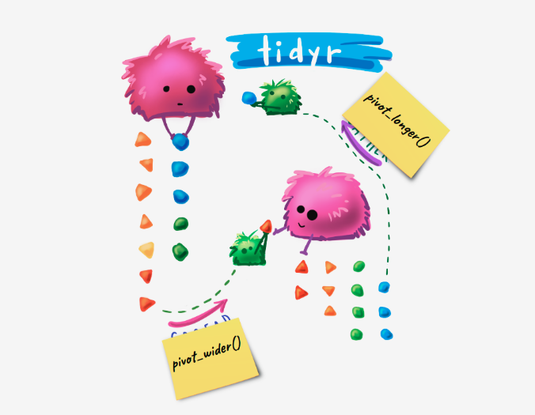

```{r options, echo = FALSE}

knitr::opts_chunk$set(warning = FALSE,
                      error = FALSE,
                      message = FALSE)

``` 

--------------------------------------------------------------------------------------  

  Ivan Recalde
  
  17-06-2020

---------------------------------------------------------------------------------------


```{r setup, include=FALSE}
knitr::opts_chunk$set(echo = TRUE)
```

# Introduccion

La idea de este pequeño tutorial es compartir las funciones  __pivot_longer() & pivot_wider()__ . Estas funciones desarrolladas por el genial Hadley Wickham, nos van a permitir hacer transposición de las bases de datos, es decir cambiar la disposición entre lo que está en las filas y lo que en las columnas. Vienen a reemplazar de manera superadora las viejas gather() & spread(), agregando interacción con funciones de otros paquetes y facilitando su uso. Todo esto se encuentra dentro de la biblioteca __tidyr__. Probablemente la tengan instalada porque viene con tidyverse, pero también es probable que deban actualizarla, les dejo la linea comentada.

```{r bibliotecas}
# install.packages("tidyr")
library(tidyverse)
```

# Modelos de Datos

Pero primero vamos a introducir algunos conceptos para entender de donde surge la necesidad de estas funciones. El mismísimo Hadley nos introduce el concepto de datos en formato Tidy (Ahhh, de ahi vendra el nombre del paquete!). Estos se encuentran en formato tidy, cuando están dispuestos con variables en las columnas y observaciones en las filas, sin que queden ni filas ni columnas con valores en blanco. Es decir cada registro de nuestro set de datos aporta una y solo una observación.

```{r tidy example, echo=FALSE}
anio <- c(2016,2017,2018,2019)
observaciones <- c(13,24,31,15)
x <- data.frame(anio, observaciones)
knitr::kable(head(x))
```

Esto nos permite trabajar de manera eficiente y fácilmente acomodable a las funciones de un paquete que también hizo Hadley... sí, tidyverse! 
Que cada fila sea una observación, nos permite trabajar con tablas que no tengan infinitas columnas, lo cual a veces dificulta hasta su exploración. Si bien esto es excelente el problema es que muchas veces los datos de entrada a nuestros scripts/algoritmos no vienen en formato tidy, sino que los encontramos de la siguiente manera.

```{r}
beatles <- read.csv2('beatles.csv')
```

```{r untidy example, echo=FALSE}
knitr::kable(head(beatles))
```

Vamos a utilizar este amigable data frame con información asociada a los ranking que tuvieron los discos de nuestros cuatro preferidos de Liverpool. Pero los nombres de las variables con espacios y en mayúsculas pueden traernos algunas dificultades así que aprovechando el artículo que inaugura __el radar__ vamos a usar el paquete janitor. Si no leiste ese bellísimo tutorial, más abajo te dejo el link. Este paquete viene a simplificar algunas cuestiones referidas a la exploración y el procesamiento de los datos. En principio vamos a utilizar la función clean_names(), para estandarizar el nombre de las columnas de manera rápida y sencilla.


```{r untidy example 2}
beatles <- janitor::clean_names(beatles)
```
```{r untidy example 2 tabla, echo=FALSE}
knitr::kable(head(beatles))
```

¿Cómo podemos entonces pasar de este formato 'untidy','messy','desordenado' al modelo que nos permite aplicar de manera sencilla la mayoría de las funciones que estamos acostumbrados de dplyr? 

# pivot_longer()

pivot_longer() como lo dice su nombre buscará hacer más largo el DataFrame, aumentando el número de registros y disminuyendo el número de columnas. [El viejo gather()] Hay 3 cosas que tenemos que identificar para aplicar la función:

  * cuales son las columnas que queremos que pasen a la nueva distribución y cuales son las que le dan valor propio al registro y quisiéramos que quedaran iguales [cols]. 
  * que nombre le vamos a dar a las categorías [names_to]. 
  * que nombre le vamos a poner a los valores [values_to].

```{r longer1}
beatles_tidy <- beatles %>% 
  tidyr::pivot_longer(cols = c('chart_position_uk','chart_position_us') ,
                      names_to = 'pais', values_to = 'puesto')
```
```{r longer1 tabla, echo=FALSE}
knitr::kable(head(beatles_tidy))
```

Aun nos falta un pequeño paso para pasarlo a modelo tidy 100%, filtrar los NA, lo cual lo podemos hacer desde la misma función. Asignándole el valor `TRUE` a la variable de entrada llamada __values_drop_na__ .

```{r longer2}
beatles_tidy <- beatles %>% 
  tidyr::pivot_longer(cols = c('chart_position_uk','chart_position_us') ,
                      names_to = 'pais', values_to = 'puesto',
                       values_drop_na = TRUE)
```
```{r longer2 tabla, echo=FALSE}
knitr::kable(head(beatles_tidy))
```

Vamos a explorar otras maneras de hacer lo mismo, para luego poder aplicarlo a otros casos. Imaginemos entonces que tenemos muchísimas variables que queremos que cambien su distribución y pocas que definen el valor del registro, bueno entonces lo que podemos hacer es pasarle las columnas que no queremos que se muevan, con un '-' adelante.

```{r longer3}
beatles_tidy <- beatles %>% 
  tidyr::pivot_longer(cols = c(-'label',-'title'), names_to = 'pais', values_to = 'puesto',
                       values_drop_na = TRUE)
```
```{r longer3 tabla, echo=FALSE}
knitr::kable(head(beatles_tidy))
```

Otro caso podría ser que nos encontremos con muchísimas columnas que queremos redistribuir y muchísimas que nos harían perder valor a nuestros registros; para evitar el engorroso trabajo de escribir muchos nombres de columnas, podríamos decir en cual columna arranca y en cual terminan estas.

```{r longer4}
beatles_tidy <- beatles %>% 
  tidyr::pivot_longer(chart_position_uk:chart_position_us, names_to = 'pais', values_to = 'puesto',
                       values_drop_na = TRUE)
```
```{r longer4 tabla, echo=FALSE}
knitr::kable(head(beatles_tidy))

```

Imaginémonos un último caso en el que las columnas no están consecutivas, bueno la función nos permite pasarle un patrón para que busque en el nombre de la columna, cuales son las que debería convertir en categorías que definen nuestras nuevas observaciones únicas. En nuestro ejemplo le podemos decir que estas columnas son las que comienzan con 'chart'. 

```{r longer5}
beatles_tidy <- beatles %>% 
  tidyr::pivot_longer(starts_with('chart'), names_to = 'pais', values_to = 'puesto',
                       values_drop_na = TRUE)
```
```{r longer5 tabla, echo=FALSE}
knitr::kable(head(beatles_tidy))
```

La función también nos permite en este mismo paso mejorar el nombre de las columnas que nos quedan, que no siempre siguen teniendo sentido. En este caso sí, pero podemos mejorarlo un poco. Completando la variable de entrada __names_prefix__, podemos decirle si había algún patrón que se repetía en todas las columnas y que queremos sacar. En este caso el 'chart_position_' parecería un buen ejemplo.

```{r longer6}
beatles_tidy <- beatles %>% 
  tidyr::pivot_longer(cols = c('chart_position_uk','chart_position_us') ,
                      names_to = 'pais', values_to = 'puesto',
                       values_drop_na = TRUE,
                      names_prefix = 'chart_position_')
```
```{r longer6 tabla, echo=FALSE}
knitr::kable(head(beatles_tidy))
```

Buenisimo! Ya podemos modificar la distribución de nuestra tabla de 'untidy' a 'tidy', pero si aprendimos a cambiar la disposición de algo estaria bueno tambien aprender a volverlo a su estado original no?

# Pivot_wider()

Pivot wider, nos va a transformar nuestro data frame original a uno más ancho; aumentando el número de columnas y disminuyendo el de filas. [el viejo spread] Este modelo suele ser mas incomodo para el trabajo de datos, pero en algunos casos para armar visualizaciones o para directamente mostrar la tabla como resultado final nos es más simple para visualizar la información. En esta función sólo necesitamos pensar de qué columna queremos sacar los nombres de las columnas y de cuál valores de las observaciones. Vamos a partir de los datos que nos quedaron en formato tidy!

```{r wider0 tabla, echo=FALSE}
knitr::kable(head(beatles_tidy))
```

Y ahora vamos a llevarlo al modelo 'untidy'!

```{r wider1}
beatles_untidy <- beatles_tidy %>% 
  pivot_wider(names_from = pais, values_from = puesto)
```
```{r wider1 tabla, echo=FALSE}
knitr::kable(head(beatles_untidy))
```

Los NA ahi suelen no ser cómodos para trabajar, y en algunos, hasta pueden tener un valor por omisión. Bueno la función nos permite simplemente arreglar eso. Lo único que tenemos que hacer es definir el parámetro de entrada __values_fill__, lo cual espera una lista con los nombres de las columnas en las que queremos realizar esta operación y los valores por defecto que debería asignar.

```{r wider2}
beatles_untidy <- beatles_tidy %>% 
  pivot_wider(names_from = pais, values_from = puesto,
  values_fill = list(puesto = 0))
```
```{r wider2 tabla, echo=FALSE}
knitr::kable(head(beatles_untidy))
```

Pensando en nuestro df original, podríamos también recuperar el prefijo que tenia cada columna. Vamos a pasarlo a castellano ya que podemos y veamos como quedaría. Lo haremos con el parámetro de entrada __names_prefix__ .

```{r wider3}
beatles_untidy <- beatles_tidy %>% 
  pivot_wider(names_from = pais, values_from = puesto,
  values_fill = list(puesto = 0),
  names_prefix = 'puesto_ranking_')
```
```{r wider3 tabla, echo=FALSE}
knitr::kable(head(beatles_untidy))
```

La potencia de esta funcion tambien nos permite generar columnas por discriminación de más de un campo. Imaginemos que el único valor que nos interesa que mantenga cada registro sea el nombre del sello discográfico y luego ver que puesto y discos tuvo.

```{r wider4}
beatles_untidy <- beatles_tidy %>% 
  pivot_wider(names_from = c(title,pais), values_from = puesto,
  values_fill = list(valores = 0))
```
```{r wider4 tabla, echo=FALSE}
knitr::kable(head(beatles_untidy))
```

Finalmente una muy simpática ilustración para recordar fácilmente cuál era cuál. Los postic son una pequeña intervención artística, ya que estaba pensada para gather() y spread(), que son las funciones que se encargaban de esta lógica.



Mas ilustraciones, todas sobre paquetes y funciones, de la genial Allison Horst (@allison_horst en Twitter) las pueden explorar en el siguiente link:

https://github.com/allisonhorst/stats-illustrations

# Cierre

Bueno hasta aquí esta breve introduccion a las funciones pivot_longer() y pivot_wider(), estas nos permitirán acomodar las dimensiones de nuestras tablas a la forma que más nos sirva para el análisis posterior; explorando un poco más podríamos llegar a encontrarnos casos donde su combinación nos sirva también! Además parece interesante tener presente que es el modelo tidy, para seguir entendiendo más sobre los datos que tenemos y como es más práctico trabajarlos.

# Bonus

Este es el link a la página de el radaR, la cual fue creada por les geniales Victoria O'Donnell y Antonio VazquezBrust, aca van a encontrar paquetes y proyectos super interesantes. Entre ellos el de janitor!

https://elradar.github.io/


