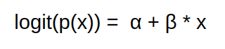

```{r options, echo = FALSE}

knitr::opts_chunk$set(warning = FALSE,
                      error = FALSE,
                      message = FALSE)

``` 
 
--------------------------------------------------------------------------------------  

  Ivan Recalde
  
  27-05-2020

---------------------------------------------------------------------------------------

# Introducción

## Objetivo

Demos inicio a este tutorial sobre modelos y regresiones, la idea es poner el foco en la práctica aunque, de todas formas vamos a ir repasando algunos conceptos teóricos que vamos a necesitar tener presentes a la hora de tomar decisiones. Comencemos!

## Modelos

¿Qué son las regresiones? Comencemos con la lineal, en estadística la regresión lineal es un modelo matemático usado para aproximar la relación de dependencia entre una variable dependiente __y__ con la variable independiente __x__ . Pero retrocedamos un poco primero.

¿Qué son los modelos? Son una construcción conceptual simplificada de una realidad más compleja. A partir de estas podremos entender mejor la realidad. Pensemos en un modelo con el que ya estuvimos trabajando bastante... Los mapas, estos son en sí una representación en 2D de nuestro mundo tridimensional. Recordemos también los diferentes sistemas de proyección cartográfica. No había uno correcto, sino que eran diferentes maneras de representar (modelar) nuestra realidad. Recordando las palabras de un estadistico británico, George E.P. Box, sostenía: "en esencia , todos los modelos están equivocados, pero algunos son útiles". 


Pensemos un ejemplo, queremos comenzar a modelar el comportamiento de un humano, entonces decimos que _todos los seres humanos pueden caminar_. Luego nos damos cuenta que un ser humano en sus primeros años de edad y en sus últimos no lo hace, entonces acomodamos el modelo: _El ser humano puede caminar siempre y cuando no se encuentre ni en sus primeros ni en sus últimos años de edad_. Genial, pero después nos damos cuenta que existen ciertas enfermedades que pueden limitar esta condición; volvemos a acomodar el modelo: _El ser humano puede caminar siempre y cuando no se encuentre ni en sus primeros ni en sus últimos años de edad y tampoco sufra alguna enfermedad que limite su caminar_. Bueno asi podriamos seguir, porque la realidad es muy compleja y depende de muchos factores, acá es donde el modelado probabilístico nos va a permitir principalmente dos cosas, primero poder abstraernos de los problemas asociados a intentar cubrir todo el espectro de datos que nos encontraríamos en el mundo real y luego poder armar sentencias donde por ejemplo nuestra afirmación pase a ser _El 84% de los seres humanos pueden caminar_ y no necesitamos explicar mucho más. Nosotros vamos a buscar en nuestros modelos un equilibrio entre el ruido que le podamos sacar a la realidad (por su costo de procesamiento o porque simplemente complejizan nuestra lógica y entendimiento posterior) y el error que le agregamos.

Tres cuestiones a tener en cuenta sobre nuestros modelos.

_Los datos_, son el contacto con la realidad de nuestro análisis y estos son multidimensionales. Imaginemos el modelo de datos de una persona, podemos pensar en sexo, edad, acceso a la educación, antecedentes clínicos, etc. Cada una es una dimensión y esto complica nuestra percepción de los datos. Veamos si decidimos trabajar con personas en dos dimensiones, por ejemplo sexo y edad, podríamos verlos representados en un eje __xy__. Ahora si quisiéramos agregar datos asociados al  acceso a la educación, deberíamos usar tres dimensiones, por ende tendríamos que pensarlo en un espacio __xyz__ que sería como nuestro plano __xy__ pero con profundidad. Acá comienza el verdadero problema, si quisiéramos agregar otra dimensión a nuestra representación ya se nos complica pensarla... Como solemos usar muchos datos asociados a una observación nos apoyamos en la matemática para trabajar estas multidimensiones. Pero tengamos esto en cuenta.


Luego los modelos cuentan con parámetros o argumentos, los cuales nos van a permitir ajustarlo de manera que se acerque lo más posible a la realidad, nuestro desafío será entonces encontrar a los valores óptimos para estos argumentos.

Por último el error, el cual vamos a necesitar medir para saber que tan alejado está nuestro modelo de la realidad o dicho de otra manera con que exactitud lo representa. Luego a partir de esta información vamos a poder mejorarlo, muchas veces modificando el valor de nuestros parámetros.

Nuestro objetivo final es tener un modelo, el cual nos permita explicar o predecir observaciones de la realidad. En un modelo de datos siempre tenemos una variable dependiente y una o más variables independientes. 

Sin más preámbulo, vamos entonces a trabajar con regresiones!

# Manos a la obra

## Carguemos los paquetes

Indiquemos a R las bibliotecas cuyas funciones queremos tener disponibles. Las funciones para generar las regresiones ya vienen con R base.

```{r}
library(tidyverse)
library(knitr) # Se usa para algunas cuestiones estéticas de nuestro RMarkdown
library(lubridate) #Manejo de fechas
```


## Cargar Datos y Explorarlos

Comencemos por cargar y explorar los datos, en este caso vamos a estar trabajando con una base con datos de covid que publicó Nación hace unos días. Le saqué algunas columnas para que sea más fácil de ver, pero su procesamiento y limpieza para acomodarla a la forma en la que necesitamos los datos la vamos a hacer todo acá. Primero vamos a leer el dataset y ver que columnas tiene.

```{r}
casos_covid <- read_csv2('casos_covid19.csv')

names(casos_covid)
```

Veamos un poco más de información asociada a cada una de las columnas. Con str().

```{r}
str(casos_covid)
```

Una exploración que suele ser útil es ver que valores puede tomar una columna que percibimos que podría ser categórica (recordamos una variable es categórica cuando tiene una cantidad finita de valores los cuales puede tomar, osea nos muestra categorías).

```{r}
unique(casos_covid$clasificacion)
```

A partir de esta primera exploración a veces nos encontramos con trabajo sobre los datos que deberíamos realizar antes que cualquier análisis, veamos que tiene la columna __edad_años_meses__

```{r}
unique(casos_covid$edad_años_meses)
```

Reconstruyamos la edad para unificar la unidad de medida en años, usando las herramientas que proporciona dplyr (paquete que viene dentro de tidyverse).

```{r}
casos_covid <-  casos_covid %>% 
  mutate(edad = if_else(edad_años_meses == 'Meses',
                        round(edad / 12),
                        edad)) %>% 
  select(-edad_años_meses)


kable(head(casos_covid))
```


## Regresión Lineal Simple

Lo primero que vamos a hacer, es realizar una regresión lineal simple, este método es uno de los mejores para explicar y transmitir conocimientos debido a su facilidad de interpretación, recuerdan cuando hablábamos de buscar el equilibrio, que nos sirva, entre exactitud de la realidad y simplicidad?

¿Qué es lo que hará? A partir de una variable independiente, relacionar el valor de la variable dependiente numérica. Intentará a partir de una recta lineal en un plano __xy__, con el menor error posible, aproximar los datos de la variable dependiente. Recordemos la ecuación de una recta.


* `Y` es nuestra variable numérica dependiente
* `a` es donde la recta corta al __eje y__, también llamada, ordenada al origen.
* `b` es la pendiente de la recta, es decir cuanto varia __y__, cada vez que muevo __x__ en una unidad.
* `x` finalmente es nuestra variable independiente.

Bueno pero pensemos ¿para qué lo podemos usar en nuestros datos? ¿Qué pregunta nos puede ayudar a responder? Vamos con una simple, _¿Cómo se relaciona en Argentina el paso del tiempo con los casos positivos de COVID?_

Genial para esto, primero debemos trabajar nuestra base, queremos llegar a tener una tabla donde por dia nos diga cuántos casos positivos hubo. Para simplificar un poco más el trabajo de los datos vamos a utilizar la cantidad de casos por semana epidemiológica.

```{r}
casos_positivos_segun_semana <- casos_covid %>% 
  filter(clasificacion == 'Confirmado') %>% 
  group_by(semana_epi) %>% 
  summarise(cantidad_de_casos = n()) %>% 
  ungroup()

head(casos_positivos_segun_semana)
```

Buenísimo, visualicemos nuestros datos. Utilizaremos ggplot para visualizar nuestros datos como una nube de puntos.

```{r}
ggplot(casos_positivos_segun_semana)+
  geom_point(aes(x = semana_epi, y = cantidad_de_casos))+
  labs(title = 'Correlacion entre tiempo y cantidad de casos confirmados')
```

Vemos entonces una correlación positiva entre cantidad de casos y la semana epidemiológica. Esto es, que el incremento de una unidad en el tiempo (nuestra variable independiente), resulta en el incremento de la cantidad de casos (nuestra variable dependiente). En este caso casi siempre se da esto, vemos la última semana con menos casos, la explicación es que puede que esta no esté con los 7 días, así que la eliminaremos al momento de crear nuestro modelo.

```{r}
casos_positivos_segun_semana <- casos_positivos_segun_semana %>% 
  filter(semana_epi != 20)

ggplot(casos_positivos_segun_semana)+
  geom_point(aes(x = semana_epi, y = cantidad_de_casos))+
  labs(title = 'Correlacion entre tiempo y cantidad de casos confirmados')
```

Una correlación negativa, sería lo opuesto, que el incremento de una variable independiente, tuviera asociado un decremento de la variable dependiente. Además del signo de una correlación, otro dato importante es su intensidad. Esta va de __-1 a 1__ y cuanto más grande su valor absoluto más fuerte es. Una correlación de cero significa que las dos variables son por completo independientes. 


Vamos a quedarnos con las siguientes categorías, pero podría uno acomodarlo.

* `de 0,7 a 1`: de fuerte a total
* `de 0,5 a 0,7`: de moderada a fuerte
* `de 0,3 a 0,5`: de débil a moderada
* `menor a 0,3`: de nula a débil

Obtener este valor se puede hacer de manera simple con la función cor(). A la cual le pasamos las dos variables de nuestro set de datos.

```{r}
cor(casos_positivos_segun_semana$semana_epi,
    casos_positivos_segun_semana$cantidad_de_casos)
```

Excelente nos dio un valor lejano a cero y muy cercano a 1, que es el valor de correlación total. Tenemos la certeza de que estos valores están correlacionados, pero todavía podemos explorar qué efecto tiene sobre la cantidad de casos, el paso de cada semana. Acá de todas formas debemos tener en cuenta que a partir del modelado estadístico, __podemos probar correlación pero no causalidad__, es decir no podemos probar que el paso del tiempo causa que aumenten los casos, es más con este ejemplo sabemos que eventualmente los casos por semana van a comenzar a bajar cuando quede poca gente sana. Es por eso que podemos decir que en este caso se mueven juntas y que nos son útiles para la creación de nuestro modelo, pero de antemano entendemos que podría no haber causalidad.

Hagamos nuestra regresión lineal simple y la guardaremos en una variable. Para esto utilizaremos la función lm(), que proviene de __linear model__ . Si escribimos lm y apretamos la tecla __F1__, nos debería llevar a la documentación asociada. De todas formas vamos a utilizar solo los dos primeros parámetros que le podemos pasar a lm. El primero le indicamos la variable dependiente, seguida de `~` que se podría leer como 'está en función de' y ahi ponemos nuestra variable independiente.

```{r}
regresion_lineal_simple <-  lm(cantidad_de_casos ~ semana_epi,
               casos_positivos_segun_semana)
```

Genial ya la creamos, veamos ahora de qué nos sirve esta variable que creamos. Lo primero que vamos a hacer es correr solamente el nombre de la variable para que nos muestre que hay adentro.

```{r}
regresion_lineal_simple
```

Esta nos indica primero como llamamos la función para recordarnos cuales definimos como variables dependiente y cual como variable independiente. Seguido de los valores de los coeficientes. El valor de __semana_epi__, nos indica cuánto aumenta __cantidad_de_casos__ cada vez que __semana_epi__ aumenta una unidad (la pendiente de la recta). Esto ya es un dato que nos permite tener bastante mas información asociada a la tendencia actual que muestra nuestro modelo. El valor __Intercept__, no nos aporta demasiada información que podamos conceptualizar dentro de nuestro dominio, pero sí será de vital importancia cuando queramos construir nuestra recta, ya que es la ordenada al origen... Sí, el valor __a__ de la ecuación.
Usemos estos datos que obtuvimos para visualizar nuestro modelo que como dijimos antes no es más que una recta!
Para eso agregaremos una capa a nuestra visualización de ggplot con la función geom_abline() a la cual le podremos pasar una ordenada al origen y su pendiente.

```{r}
ggplot(casos_positivos_segun_semana)+
  geom_point(aes(x = semana_epi, y = cantidad_de_casos))+
  labs(title = 'Correlacion entre tiempo y cantidad de casos confirmados')+
  geom_abline(aes(intercept = -1142, slope = 121), color = 'blue')
```

Genial, aprovechemos otra herramienta que nos proporciona ggplot donde podemos definir los límites del plano donde está dibujando la visualización así vemos mas adelante cuales valores predice nuestro modelo.


```{r}
ggplot(casos_positivos_segun_semana)+
  geom_point(aes(x = semana_epi, y = cantidad_de_casos))+
  labs(title = 'Correlacion entre tiempo y cantidad de casos confirmados')+
  geom_abline(aes(intercept = -1142, slope = 121), color = 'blue')+
  xlim(c(9,25))+
  ylim(0, 2000)
```

Podemos también a modo de acompañamiento de la exploración querer predecir algunos valores en particular, esto lo haremos con la función predict(), a la cual le pasamos nuestro modelo y un dataframe con las variables independientes, en este caso solo semana_epi. Usamos la función tibble() para crear un data frame con la columna semana_epi y los valores a predecir.

```{r}
semanas_a_predecir<-tibble(semana_epi=c(25,30))
predict(regresion_lineal_simple,semanas_a_predecir)
```

Bueno pero volvamos a nuestra representación visual un momento, vamos a ver dos cosas más, primero es que ggplot(), nos permite armar en el caso de que solo queramos la exploración visual, agregar una capa donde visualicemos la regresión lineal asociada a una nube de puntos que tengamos. Veamos a partir del siguiente ejemplo usando geom_smooth(), como sin pasarle la regresión nos arma la misma visualización. Deberemos de todas formas indicar cuál es nuestra __y__ (variable dependiente), cuál es nuestra __x__ (variable independiente) y que metodo queremos utilizar, __lm__ en este caso de linear model. Además setearemos como __FALSE__ el último parámetro, __se__ que sirve para que nos muestre el intervalo de confianza.

```{r}
ggplot(casos_positivos_segun_semana)+
  geom_point(aes(x = semana_epi, y = cantidad_de_casos))+
  labs(title = 'Correlacion entre tiempo y cantidad de casos confirmados')+
  geom_smooth(aes(x = semana_epi, y = cantidad_de_casos), method = 'lm', se = F)
```

A partir de nuestra regresión lineal podemos reforzar otros conceptos, usemos una definición un poco más específica sobre qué es lo que hacía entonces la regresión lineal, _busca la recta que atraviesa nuestra nube de puntos de modo tal que la suma de las distancias a cada punto con valor real al predecido por la línea sea lo menor posible._ Estas distancias se llaman residuos y veamos que podemos ver con ellas.

## Residuos

Los residuos estadísticamente hablando son las diferencias entre los valores de __y__ reales y los predecidos por el modelo. Es decir, la distancia entre la cantidad de casos que efectivamente hubo en la semana 13 y cuantos predijo la recta. Cuando nuestros residuos son pequeños, diremos que nuestro modelo se ajusta bien a los datos observados. Cuando los residuos son grandes todo lo contrario, esto indica que quizás deberíamos buscar otra forma de armar nuestro modelo. Siempre recordemos nuestro principio de intentar encontrar un equilibrio, un modelo siempre se puede seguir acercando a la realidad pero cada vez será más complejo!

R también nos proporciona una función para saber el valor de los residuos para cada valor que originalmente conocíamos.

```{r}
residuals(regresion_lineal_simple)
```

Esto nos dice cuál fue el residuo para cada observación que le proporcionamos a nuestro modelo. No es momento de entrar en pánico, ya que lo esperado es que haya una diferencia. Busquemos explorarlo de manera gráfica, para ver algunas cosas más sobre estos valores. Para esto usaremos de nuevo ggplot, pero en la primera línea no le diremos el dataframe origen de nuestros datos ya que utilizaremos una combinación de cosas. Para nuestra primer capa, representaremos los valores de los residuos pero asociados a los valores del eje x original. Luego agregaremos otra capa que nos deje bien marcado el __eje x__.


```{r}
ggplot()+
  geom_point(aes(x = casos_positivos_segun_semana$semana_epi, y = residuals(regresion_lineal_simple)))+
  geom_hline(yintercept = 0, col = 'blue')+
  labs(y = 'residuo del modelo lineal')
```

Lo que queremos que suceda al ver esta representación es que los errores se distribuyen sin ningún patrón aparente. Es decir que no haya muchos más por encima del __0__ que por debajo ni al revés. Y que no haya una tendencia de aumento o decrecimiento a lo largo del __eje x__.

## Regresión Lineal Simple a partir de variable categórica

Hagamos la regresión a partir de una variable categórica, pensemos una nueva pregunta. _¿Cómo se relacionan la cantidad de casos notificados con la provincia?_ Para no tener un único caso por provincia sino varios vamos a resguardar también la columna asociada al departamento de residencia. Por otra parte para acotar un poco los datos vamos a ver sólo las provincias de Cuyo, para eso generamos nuestro data set.

```{r}
casos_positivos_segun_provincia <- casos_covid %>% 
  filter(provincia_residencia %in% c("Mendoza", "San Juan", "La Rioja","San Luis")) %>% 
  group_by(provincia_residencia, departamento_residencia) %>% 
  summarise(cantidad_de_casos = n()) %>% 
  ungroup()

kable(head(casos_positivos_segun_provincia))
```

Vamos a visualizar nuestros datos, como nuestro eje x son las provincias es probable que varios datos se solapen, para eso en lugar de geom_point(), utilizaremos geom_jitter(), que nos agrega un pequeño ruido o error, al eje x, para poder verlos mejor.

```{r}
ggplot(casos_positivos_segun_provincia)+
  geom_jitter(aes(x=provincia_residencia, y = cantidad_de_casos, color = provincia_residencia))
```

Entendemos entonces que la provincia incide en la cantidad de casos notificados, corramos entonces nuestra regresión lineal.

```{r}
regresion_lineal_variable_categorica <-  lm(cantidad_de_casos ~ provincia_residencia,
               casos_positivos_segun_provincia)

regresion_lineal_variable_categorica
```

Bueno, intentemos comprender qué nos dicen tantos coeficientes. 
Primero vemos que seguimos teniendo nuestro __intercept__ que sigue siendo el valor de ordenada al origen (recordamos que era el __a__ de nuestra ecuación de una recta). Luego tenemos nuestras provincias, pero... falta una! La Rioja!! No vamos a dejar afuera esta bella provincia de valientes caudillos... Y no me estoy refiriendo a Carlos. 
Lo que sucede acá es que la regresión lineal identificó que lo que le pasamos es una variables categórica y al explorar los niveles que tenía, encontró los valores que podía tomar esta variable. Luego tomó el primero en orden alfabético y lo metió en el cálculo original de los coeficientes. De esta manera, el resto de las provincias funcionan como una especie de interruptor prendido/apagado en nuestra ecuación. 
Es decir que si le pasamos La Rioja el valor será 48,56, el del resto de las provincias lo cuantifica en relación al de esta primera provincia. Si quisiéramos predecir el valor para  la cantidad de casos de Mendoza, deberíamos encender su interruptor, de esta manera le sumamos 35,11 al valor de La Rioja y tenemos el valor predecido. Para predecir la cantidad de casos en San Juan deberíamos apagar el interruptor de Mendoza y encender el de San Juan de esta manera al valor base le restamos 23,89. El tratamiento de las variables categóricas en las regresiones lineales siempre será de esta manera, agarrara el primer valor y lo asumirá en el cálculo de la ordenada de origen, luego los otros acomodan el valor predecido. Asi podemos entender como afecta nuestra variables independiente a la dependiente. Veamos los residuos.

```{r}
ggplot()+
  geom_point(aes(x=casos_positivos_segun_provincia$provincia_residencia,
                  y = residuals(regresion_lineal_variable_categorica),
                  color = casos_positivos_segun_provincia$provincia_residencia))+
  geom_hline(yintercept = 0, col = 'blue')+
  labs(x = 'provincia_residencia', y = 'residuos modelo lineal',
       color = 'provincia_residencia')
```

¿Qué podemos ver acá? Vemos como el cálculo en La Rioja se ve totalmente afectado por un __outlier__. Estos valores debemos evaluarlos con mayor profundidad siempre que los encontremos, de esta manera evaluar si nos aportan valor a nuestro modelo o solo ruido. En este caso tenemos un número muy acotado de observaciones y podríamos ir a ver ese caso específico para intentar comprender si tiene sentido dejarlo. Spoiler Alert en este caso es la Capital. Pero muchas veces nos encontramos con miles o millones de observaciones y es muy costoso el análisis de todos los outliers, limpiarlos ahí parecería lo más recomendable, pero... corremos el riesgo de perder valores que le daban sentido al modelo. ¿Entonces? La realidad es que nuestra única solución es siempre contar con conocimientos del dominio y poder tomar la decisión con algún criterio más técnico. Pero no los perdamos de vista.

## Regresión Lineal con múltiples variables

Simplificar nuestro estudio a pensar que una única variable independiente define el resultado de una variable dependiente, muchas veces cae fuera del equilibrio del que venimos hablando entre simplicidad y exactitud. Por eso vamos a ver cómo se comporta la regresión con multiple variables independientes. Por otra parte, a partir de acá comenzamos a perder cada vez más las abstracciones de nuestra realidad que nos permiten un entendimiento más simple de nuestro modelo.

Veamos cómo sería agregar más variables a nuestra regresión, pero primero pensemos una pregunta que nos gustaría contestarnos. Vamos a queres ver que variables de nuestro dataset son significativamente representativas para la predicción del número de fallecidos por coronavirus. Para esto no vamos a utilizar solo el paso del tiempo sino que vamos a agregar información sobre la cantidad de casos confirmados en pacientes de riesgo y la cantidad de personas que precisaron asistencia respiratoria ese dia. Para eso deberemos entonces crear nuestro dataset donde tengamos en cada registro no solo la cantidad de casos del dia sino también estos otros datos.

```{r}
fallecidos <-  casos_covid %>% 
  filter(fallecido == 'SI') %>%
  filter(!is.na(edad)) %>% 
  mutate(edad_riesgo = if_else(edad>= 65,1,0),
         asistencia_respiratoria_mecanica = if_else(asistencia_respiratoria_mecanica=='SI',1,0)) %>% 
  group_by(semana_epi) %>% 
  summarise(cantidad_fallecidos = n(), pacientes_edad_riesgo = sum(edad_riesgo),
            gente_preciso_asistencia_respiratoria = sum(asistencia_respiratoria_mecanica)) %>% 
  ungroup()

kable(head(fallecidos))
```


Buenisimo, armemos la regresión con todas las variables del data frame. Ver que en lugar de definir el nombre de cada una de las variables independientes podemos poner un __'.'__. Esto le informa a la función que nuestra variable dependiente debe ser evaluada contra todo el resto de las variables de nuestro set de datos.

```{r}
regresion_lineal_multiple <-  lm(cantidad_fallecidos ~ . ,
               fallecidos)

regresion_lineal_multiple
```

¿Cómo interpretamos estos valores? Bueno seguimos teniendo el intercept, que servirá para la creación del modelo. Luego el resto de las variables independientes obtuvieron un coeficiente. ¿Podemos entonces seguir diciendo que cada semana que pasa la cantidad fallecidos aumenta en 0,04737? Podemos decirlo pero a esta afirmación hay que agregarle una parte nueva, esto se dará siempre y cuando el resto de las variables independiente se mantengan constantes. Es decir al lapso de una semana aumentaran los fallecidos en 0,04737 respecto a la semana anterior, siempre y cuando la cantidad de pacientes de riesgo en los casos se mantenga constante y la cantidad de gente que necesito respiradores también se mantenga constante.

Veamos que tanto tiene que ver la semana en la cantidad de fallecidos, porque parece un número muy chico ese 0,04737. Que el coeficiente sea chico, quiere decir que varía poco el valor de mi variable dependiente y suele ser una señal de que debemos prestarle mayor atención.

```{r}
cor(fallecidos$cantidad_fallecidos,
    fallecidos$semana_epi)
```

Como vemos la intensidad de 0,57 es moderada, no pareciera ser un gran descriptor ahora que tenemos las otras variables. LA razón por la cual aparece en esta regresión, es simplemente porque nosotros la agregamos. Pero entonces a partir de acá ¿cómo identificar cuales variables independientes son buenos predictores dentro de nuestro modelo? Bueno podemos usar la misma función __summary__ que venimos usando en data frames para que nos de información asociada al objeto que le pasamos, en este caso la regresión.

```{r}
summary(regresion_lineal_multiple)
```

¿Que podemos ver aquí? 

* Los parámetros que definieron el modelo.
* Los valores por cuartil de los residuos.
* Tabla de coeficientes, donde encontramos columna __estimate__,  tenemos el efecto que ejercen por unidad sobre la variable dependiente (son los coeficientes con los que veníamos trabajando). Luego la otra columna a la que le vamos a prestar especial atención es la última, que tiene el __valor P__. El valor P es el que nos permite rechazar la Hipótesis Nula, que en este caso está planteada como que la variable no es estadísticamente significativa, para predecir el valor. Recordamos que para rechazar __H0__, nuestro __valor P__ debe ser menor a __0,05__, siendo este el valor máximo que aceptamos en nuestro intervalo de confianza aceptado por defecto. Este valor también lo podríamos haber definido como __0,01__ (esto dependerá de la rigurosidad que debamos/queramos respetar). En este caso R nos ayudará gráficamente a identificar estas variables agregando según corresponda:

  + `.` cuando el valor p estuvo entre 0,1 y 0,05  
  + `*` cuando el valor p está entre 0,05 y 0,01
  + `**` cuando el valor p esta entre 0,01 y 0,005
  + `***` cuando el valor p en menor a 0,005
 
Está presente el error estándar de los residuos pero nos vamos a quedar con otros dos valores acá. El R cuadrado que recordamos que era un calculo a partir de estos mismos residuos, pero que buscaba penalizar las distancias largas y el Método R cuadrado ajustado, el cual a diferencia del anterior busca penalizar también el uso de más variables independientes. Lo que tenemos que tener en claro es que queremos que estos valores los cuales varían entre __0 y 1__ sean lo más alto posibles.

Vemos entonces que podríamos sacar la variable asociada a la semana en este caso y volver a correr nuestra regresión. Ahora si debemos decirle cuales son las variables dependientes de nuestro set de datos. Los agregamos con un __+__ posterior al signo __~__.

```{r}
regresion_lineal_multiple_mejorada <-  lm(cantidad_fallecidos ~ 
                                            pacientes_edad_riesgo + gente_preciso_asistencia_respiratoria ,
                                          fallecidos)

summary(regresion_lineal_multiple_mejorada)
```

Como ven nuestro R cuadrado se mantuvo constante mientras que nuestro R cuadrado ajustado aumentó! Llegamos un mejor modelo. Por último pero no por eso menos importante, podemos confirmar superando un 95% de confianza que la variable __gente_preciso_asistencia_respiratoria__, es predictora de nuestra variable independiente; también superando un 99,9% de confianza que __pacientes_edad_riesgo__, es variable predictora de nuestra variable dependiente.

## Regresión Logística
 
Este tipo de regresión normalmente usado para clasificación, lo usaremos para predecir la probabilidad de un evento __y__ de suceder en función de las variables independientes. Es decir nuestra variable dependiente pasa a ser dicotómica y puede tomar dos valores __0 o 1__. Esta regresión buscará asociar una probabilidad (valores entre cero y uno), para cada valor de nuestra variable independiente. 

Pero antes de meternos en detalle, intentemos explicar la razón por la cual no seguimos usando regresiones lineales para resolver este problema.

Exploremos nuestro ejemplo original de ver cómo se relaciona la cantidad de casos por semana a lo largo del tiempo, pero llevemos esa cantidad de casos a una variable dicotómica, es decir binaria. Vamos a buscar obtener un set de datos donde lo que se nos informe de cada dia sea, _si la cantidad de casos superó o no la media de casos_. Para eso crearemos la siguiente base.

```{r}
casos_positivos_segun_dia <- casos_covid %>% 
  filter(clasificacion == 'Confirmado') %>% 
  group_by(fecha) %>% 
  summarise(cantidad_de_casos = n()) %>% 
  ungroup()

kable(head(casos_positivos_segun_dia))
```

Ahora vamos a crear nuestra variable dicotómica donde vamos a guardar un __1__ en caso de que la cantidad de casos de un dia supera la media de casos o un __0__ caso contrario. Esta será nuestra variable dependiente.

```{r}
casos_mayor_media_segun_dia <- casos_positivos_segun_dia %>% 
  mutate(casos_supera_media = if_else(cantidad_de_casos > mean(as.numeric(cantidad_de_casos)),1,0)) %>% 
  select(- cantidad_de_casos)

kable(head(casos_mayor_media_segun_dia))

```

Armemos la visualización de los datos y agreguemos una capa con geom_smooth() para que nos genere automáticamente la representación visual de la regresión lineal asociada.

```{r}
ggplot(casos_mayor_media_segun_dia)+
  geom_point(aes(x = fecha, y = casos_supera_media))+
  labs(title = 'Correlacion entre tiempo y cantidad de casos confirmados')+
  geom_smooth(aes(x = fecha, y = casos_supera_media), method = 'lm',
              se = FALSE)
```

Vemos acá como a la línea recta le cuesta bastante acomodarse a nuestros datos, de tal manera que encima se pasa de nuestros limites del eje __y__ que eran entre __0__ y __1__. Lo ideal sería entonces encontrar una función que se adapte a esta problemática. Visualmente podríamos decir que lo que buscamos es una función que debería parecerse a la línea pero achatado en los extremos, ¿verdad? De esta manera que no tome valores mayores a __1__ ni menores a __0__. Bueno, esa función existe y se puede adaptar a la de la recta usando la función logit(). Que hará que nos quede lo siguiente.


Como para tener un vistazo rápido veamos la solución visual que nos proporciona ggplot para este problema.

```{r}
ggplot(casos_mayor_media_segun_dia, aes(x = fecha, y = casos_supera_media))+
  geom_point()+
  labs(title = 'Correlacion entre tiempo y cantidad de casos confirmados')+
  geom_smooth(method = 'glm',
              method.args = list(family = "binomial"),
              color = "blue",
              se = FALSE)


```

Excelente! Ahora sabemos como se ve esa función a la que queremos llegar.

Los coeficientes __β y α__ de la ecuación logística son desconocidos, y han de estimarse a partir de los datos de entrenamiento. Mientras que en regresión lineal los coeficientes del modelo se estiman por mínimos cuadrados, en regresión logística se utiliza el método de máxima verosimilitud (máximum likelihood): se buscan coeficientes tales que la probabilidad prevista __p(xi)__ de éxito se aproxime lo máximo posible a las observaciones reales. Es decir el valor de los parámetros __β y α__ con los que se maximiza la probabilidad de obtener los datos observados. Para cada valor de __x__ que vale 1, quiero que su probabilidad de ser 1, sea la mayor posible. Lo mismo para las observaciones de __x__ con valor cero.


Ahora creemos nuestra regresión. Usaremos una nueva función glm() (generalized linear models), pero será bastante parecido al uso que veníamos haciendo con lm(). Primero escribimos la variable dependiente en función (`~`) de las variables independientes. En este caso ponemos un punto porque serán todas, es decir la única que tenemos. Luego indicaremos que es binomial, ya que puede tomar valores de cero y uno. Por último indicaremos el data set.

```{r}
regresion_logistica <-  glm(formula = casos_supera_media ~ .,
                 family = binomial,
                 data = casos_mayor_media_segun_dia)

regresion_logistica
```

Comencemos de nuevo prestando atención a los coeficientes, que también sirven para generar una recta. De ahí que la función habla de modelo lineal. Veamos otra forma de expresar nuestra regresión.



La realidad es que R por detrás muchos de los cálculos los va a resolver proyectando en una línea recta nuestra curva y nuestros valores. Lo que nos importa acá es comprender los coeficientes que nos muestra, los cuales corresponden a esta ecuacion. Ahora lo que podremos decir es que aumentar la variable independiente, aumentará __β__ veces el logit de la probabilidad. Por su parte __α__ (la ordenada al origen), nos indicará cual es el valor logit de la probabilidad en la cual comenzamos a calcular (donde corta el eje y). Si bien no es tan directo como en la regresión lineal, nos permite comprender cómo funcionan en nuestro modelo ambos coeficientes.

Evaluemos los resultados obtenidos.
A la hora de evaluar la validez y calidad de un modelo de regresión logística, se analiza tanto el modelo en su conjunto como los predictores que lo forman.

Se considera que el modelo es útil si es capaz de mostrar una mejora explicando las observaciones respecto al modelo nulo (sin predictores). El test Likelihood ratio calcula la significancia de la diferencia de residuos entre el modelo de interés y el modelo nulo. El estadístico sigue una distribución chi-cuadrado con grados de libertad equivalentes a la diferencia de grados de libertad de los dos modelos. El modelo nulo, para entenderlo mejor, directamente encontrará la probabilidad en ver la proporción de observaciones que teníamos con valor 1 sobre el universo total.

De nuevo vamos a basarnos en el __valor p__, el cual buscaremos que sea menor a nuestro intervalo de confianza, que en este caso volveremos a utilizar __0,05__. De esta manera estaremos en condiciones de rechazar la Hipótesis Nula, la cual está planteada como la no influencia de nuestros predictores.

Para esto usaremos la función anova a la cual le pasaremos nuestro modelo y le indicaremos el test 'Chisq' que viene de __Chi Square__.

```{r}
anova(regresion_logistica, test = "Chisq")
```

Excelente! Como nos muestra __***__ , nos indica que el valor está dentro del intervalo de confianza que habíamos definido. Recordamos que los tres asteriscos, indican que el __valor p__, es menor a __0,001__, por lo tanto podemos rechazar con un intervalo de confianza mayor al 99,9%, la Hipótesis Nula y confiar en nuestros predictores.

Originalmente si armamos una visualización de nuestros datos, ya podemos darnos cuenta cómo viene la mano.


Por último,vamos a usar nuestra regresión para predecir valores nuevos, veamos la probabilidad de que la cantidad de casos  supere la media de casos para hoy y para dentro de una semana.

```{r}
prob_pred = predict(regresion_logistica,
                    type = 'response',
                    newdata = tibble(fecha = c(ymd('2020-05-27'),ymd('2020-06-03'))))
prob_pred
```

Una de las principales aplicaciones de un modelo de regresión logística como habíamos dicho, es clasificar la variable cualitativa en función de valor que tome el predictor. Pero si observamos lo que obtuvimos como resultado son las probabilidades de que __y__ sea __1__. Para conseguir esta clasificación, es necesario establecer un threshold de probabilidad a partir de la cual se considera que la variable pertenece a uno de los niveles. Por ejemplo, se puede asignar una observación al grupo __1__ si `p̂ (Y=1|X)>0.`5 y al grupo `0`casoo contrario.


```{r}
predicciones <- ifelse(test = prob_pred > 0.5, yes = 1, no = 0)

predicciones
```


# Conclusión

Llegamos al final, ojalá haya servido como para tener una idea general sobre cómo aplicar estas técnicas de modelado en R y cuales serian algunos pasos y buenas prácticas a seguir. Algunas líneas a explorar que quedaron sin lugar en este tutorial, creo que estudiando la curva de casos de covid, sería muy acorde explorar las regresiones polinómicas, ya que probablemente, nuestra curva se convierta en exponencial, con muy pocos pasos, podremos mejorar muchísimo nuestro modelo. Por otro lado regresiones logísticas a partir de varias variables independientes, es otro desafío que estaría bueno explorar, ya que podriamos armar potentes clasificadores!
